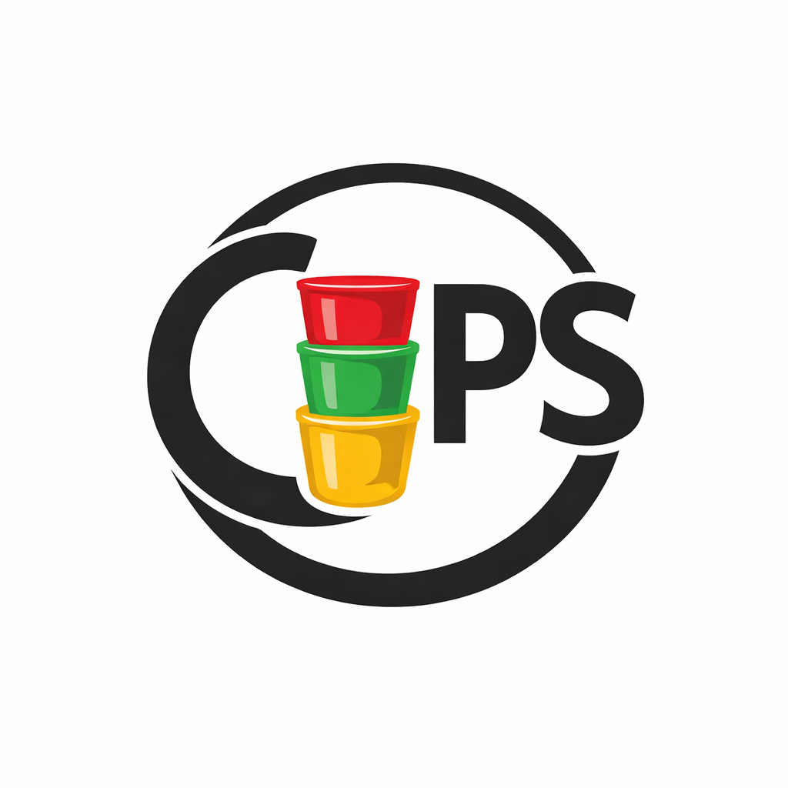

# OpenCups

### Live Feedback for Presenters

 

 

 

 

 

 

 

---

##  The traffic light cups technique  [[1]](https://cloudfront-s3.solutiontree.com/pdfs/Reproducibles_EFA/The-Main-Idea-Embedded-Formative-Assessment-March-2013.pdf) [[2]](https://www.nwesd.org/wp-content/uploads/2013/08/PROL_Colored_Cups_kdj.pdf)

This system offers a simple, intuitive way to gather real-time audience feedback.
Participants indicate their level of understanding (originally done plastic cups) using a simple color code:

🟢 Green → Following easily

🟡 Yellow → Need more explanation

🔴 Red → Cannot follow

The presenter sees an aggregate view of the responses and can adjust the lecture accordingly.

### How to Use This App:
Open https://open-cups.streamlit.app/ or [run locally](#run-locally)

1. **Create a Room:**
The presenter starts a new session, which generates a unique room.
2. **Share the Access Link:**
The presenter shares the room ID, a direct link, or a QR code with the audience.
3. **Gather Live Feedback:**
Participants join to share their status and ask/vote on questions.

## Run locally

1. `git clone https://github.com/BayerC/open_cups.git`
2. `cd open_cups/`
3. `Install uv: https://docs.astral.sh/uv/getting-started/installation/`
4. To run app locally: `uv run streamlit run main.py`

## Contributing

1. [Run locally steps](#run-locally)
2. Hook pre-commit into git: `uv run pre-commit install`
3. To run pre-commit manually run: `uv run pre-commit run --all-files`

### Dependency Management

This project uses [uv](https://docs.astral.sh/uv) for dependency management:

- [pyproject.toml](pyproject.toml): Defines dependencies with version constraints.
- [uv.lock](uv.lock): Lockfile with exact versions for all platforms. Committed to version control.
- [requirements.txt](requirements.txt): Auto-generated from [uv.lock](uv.lock) for deployment compatibility (e.g., Streamlit Cloud). DO NOT edit manually - it's regenerated by pre-commit hooks. Committed to version control for deployment platforms that don't support [uv](https://docs.astral.sh/uv/https:/) natively.

## Relation to existing cups projects

This is a scalable, tested, and modern rewrite of https://github.com/fastai/fastcups in python using https://streamlit.io/ that supports multiple rooms hosted on the same server.

Other teaching institutions had this idea before, see for example [these](https://www.nwesd.org/wp-content/uploads/2013/08/PROL_Colored_Cups_kdj.pdf) and [these](https://www.sstr2.org/Downloads/Cups%20as%20student%20feedback.pdf) instructions.
